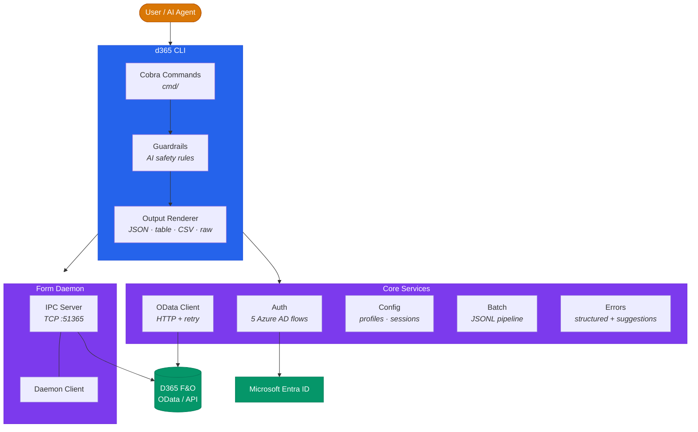

# D365 — CLI for Dynamics 365 Finance & Operations

[](https://github.com/seangalliher/d365-erp-cli/actions/workflows/ci.yml)
[](LICENSE)
[](https://goreportcard.com/report/github.com/seangalliher/d365-erp-cli)

**kubectl for D365** — a structured, scriptable CLI for Dynamics 365 Finance & Operations. Designed as the primary interface for AI agents, with full human usability.

<!-- TODO: Replace with actual video URL when recorded -->
[](https://github.com/seangalliher/D365-erp-cli)

## Features

- **25+ commands** covering Data (OData), API (actions), Form (stateful UI), and diagnostics
- **Structured JSON output** on every command — predictable parsing for AI agents
- **TTY auto-detection** — JSON when piped, tables when interactive
- **5 auth methods** — browser, device-code, client-credentials, az-cli, managed-identity
- **AI agent guardrails** — cross-company auto-injection, `$select` warnings, enum validation, delete confirmation
- **AI agent system prompt** — `d365 agent-prompt` generates a complete tool description for AI agents
- **Interactive quickstart** — `d365 quickstart` guides first-time users through setup
- **Self-diagnosing** — `d365 doctor` checks config, auth, DNS, connectivity, and daemon health
- **Shell completion** — PowerShell, Bash, Zsh, and Fish via `d365 completion`
- **Batch mode** — JSONL pipeline for multi-command execution in a single invocation
- **Background daemon** — stateful form sessions with auto-start and idle timeout
- **Cross-platform** — Windows, macOS, Linux (amd64 + arm64)

## Quick Start

```bash
# Install (requires Go 1.26+)
go install github.com/seangalliher/d365-erp-cli@latest

# Interactive guided setup
d365 quickstart

# Or connect manually
d365 connect https://your-env.operations.dynamics.com

# Query data
d365 data find Customers --query '$top=5&$select=CustomerAccount,Name'

# Check status
d365 status

# Run diagnostics
d365 doctor
```

## Command Reference

### Connection
```bash
d365 connect <url>           # Connect with interactive auth
d365 connect <url> --auth client-credentials --client-id <id> --client-secret <secret>
d365 disconnect              # End session
d365 status                  # Show connection status
d365 company get             # Get current company
d365 company set USMF        # Switch company
```

### Data (OData)
```bash
d365 data find-type <search>          # Find entity types
d365 data metadata <entity>           # Get entity schema
d365 data find <entity> --query "..." # Query entities
d365 data create <entity> --data '{...}'
d365 data update --data '[{"ODataPath":"...","UpdatedFieldValues":{...}}]'
d365 data delete --paths '["Customers(...)"]' --confirm
```

### API (Actions)
```bash
d365 api find <search>                # Find available actions
d365 api invoke <action> --params '{...}'
```

### Forms (Stateful)
```bash
d365 form find <search>               # Find menu items
d365 form open CustTable --type Display
d365 form state                       # Get form controls/values
d365 form click <control>             # Click a button
d365 form set Name=Value              # Set field values
d365 form lookup <control>            # Open a lookup
d365 form tab <tab> --action Open     # Open/close tabs
d365 form filter <control> <value>    # Filter form
d365 form grid-filter <col> <val> --grid Grid1
d365 form grid-select <row> --grid Grid1
d365 form grid-sort <col> --grid Grid1 --direction Descending
d365 form find-controls <search>      # Search for controls
d365 form save                        # Save form
d365 form close                       # Close form
```

### Utilities
```bash
d365 quickstart              # Interactive guided setup
d365 doctor                  # Run diagnostic health checks
d365 agent-prompt            # Generate AI agent system prompt
d365 agent-prompt --json     # Same, wrapped in JSON envelope
d365 completion powershell   # Shell completion script
d365 schema                  # Export CLI schema (for AI tool registration)
d365 docs <topic>            # Built-in documentation
d365 batch                   # JSONL batch mode from stdin
d365 daemon status           # Check daemon status
d365 version                 # Show version info
```

## AI Agent Integration

D365 is designed as the primary CLI for AI agents interacting with D365 F&O.

### Example: Creating a Legal Entity with GitHub Copilot

> **Prompt:** *"Create a new legal entity called ACME Corp with ID ACME, then set up its chart of accounts and general ledger."*

Copilot uses the D365 CLI to execute each step automatically:

```bash
# Step 1 — Find the right entity type for legal entities
$ d365 data find-type "legal entities"
✓ Found: LegalEntities

# Step 2 — Check the entity schema to know which fields to set
$ d365 data metadata LegalEntities --query '$select=Name'
✓ Fields: LegalEntityId, Name, CompanyType, AddressCountryRegion, ...

# Step 3 — Create the legal entity
$ d365 data create LegalEntities --data '{
    "LegalEntityId": "ACME",
    "Name": "ACME Corp",
    "CompanyType": "Organization",
    "AddressCountryRegion": "USA"
  }'
✓ Created LegalEntities(dataAreaId='ACME')

# Step 4 — Switch context to the new company
$ d365 company set ACME
✓ Company set to ACME

# Step 5 — Find the chart of accounts entity
$ d365 data find-type "chart of accounts"
✓ Found: LedgerChartOfAccounts

# Step 6 — Create a chart of accounts
$ d365 data create LedgerChartOfAccounts --data '{
    "ChartOfAccounts": "ACME-COA",
    "Description": "ACME Corp Chart of Accounts"
  }'
✓ Created LedgerChartOfAccounts('ACME-COA')

# Step 7 — Find the ledger configuration entity
$ d365 data find-type "ledger"
✓ Found: Ledgers

# Step 8 — Configure the general ledger for ACME
$ d365 data create Ledgers --data '{
    "ChartOfAccounts": "ACME-COA",
    "Name": "ACME General Ledger",
    "AccountingCurrency": "USD",
    "ReportingCurrency": "USD",
    "FiscalCalendar": "Standard"
  }'
✓ Created Ledgers for ACME

# Step 9 — Create main accounts in the chart of accounts
$ d365 data find-type "main accounts"
✓ Found: MainAccounts

$ d365 data create MainAccounts --data '{
    "MainAccountId": "110100",
    "Name": "Cash - Operating",
    "MainAccountType": "BalanceSheet",
    "ChartOfAccounts": "ACME-COA"
  }'
✓ Created MainAccounts('110100')

$ d365 data create MainAccounts --data '{
    "MainAccountId": "400100",
    "Name": "Revenue",
    "MainAccountType": "Revenue",
    "ChartOfAccounts": "ACME-COA"
  }'
✓ Created MainAccounts('400100')

$ d365 data create MainAccounts --data '{
    "MainAccountId": "600100",
    "Name": "Operating Expenses",
    "MainAccountType": "Expense",
    "ChartOfAccounts": "ACME-COA"
  }'
✓ Created MainAccounts('600100')

# Step 10 — Verify the setup
$ d365 data find MainAccounts \
    --query '$filter=ChartOfAccounts eq "ACME-COA"&$select=MainAccountId,Name,MainAccountType'
┌────────────────┬────────────────────┬──────────────┐
│ MainAccountId  │ Name               │ Type         │
├────────────────┼────────────────────┼──────────────┤
│ 110100         │ Cash - Operating   │ BalanceSheet │
│ 400100         │ Revenue            │ Revenue      │
│ 600100         │ Operating Expenses │ Expense      │
└────────────────┴────────────────────┴──────────────┘
```

Every step returns structured JSON, so the agent can inspect results, handle errors, and chain operations — no screenshots, no clicking, no guesswork.

> **Want to try it yourself?** The full example with ready-to-use JSON files, a JSONL batch script, and a Copilot prompt is in [`examples/legal-entity-setup/`](examples/legal-entity-setup/). Run the entire setup in one command:
> ```bash
> cat examples/legal-entity-setup/batch.jsonl | d365 batch
> ```

### System Prompt Generation

Generate a comprehensive system prompt that teaches an AI agent the entire CLI:

```bash
d365 agent-prompt            # Raw markdown — paste into agent config
d365 agent-prompt --json     # JSON envelope for programmatic use
```

### Standard JSON Envelope

Every command returns this structure:

```json
{
  "success": true,
  "command": "d365 data find",
  "data": { ... },
  "error": null,
  "metadata": {
    "duration_ms": 142,
    "company": "USMF",
    "timestamp": "2026-01-01T00:00:00Z"
  }
}
```

### Tool Registration

Export the full CLI schema for AI tool registration:

```bash
d365 schema --full | jq .
```

### Batch/Pipeline Mode

Send multiple commands via JSONL on stdin:

```bash
echo '{"command":"data find","args":{"entity":"Customers","query":"$top=3"}}
{"command":"data find","args":{"entity":"Vendors","query":"$top=3"}}' | d365 batch
```

### Guardrails

Built-in safety checks for AI agents:
- **cross-company**: Auto-injects `cross-company=true` when filtering by `dataAreaId`
- **select-recommended**: Warns when `$select` is missing from queries
- **delete-confirm**: Blocks deletes without `--confirm`
- **wide-query**: Warns on queries without `$top` or `$filter`
- **enum-format**: Warns when numeric values are used for enum fields

### Exit Codes

| Code | Meaning |
|------|---------|
| 0 | Success |
| 1 | Command error |
| 2 | Connection/auth/timeout error |
| 3 | Validation/input error |

## Configuration

```bash
# Config file location
~/.d365cli/config.json

# Environment variables
D365_URL            # Default environment URL
D365_COMPANY        # Default company
D365_CLIENT_ID      # Service principal client ID
D365_CLIENT_SECRET  # Service principal secret
D365_TENANT_ID      # Azure AD tenant ID
D365_AUTH_METHOD    # Auth method override
D365_PROFILE        # Active profile name
D365_OUTPUT         # Output format (json/table/csv/raw)
D365_CI             # CI mode (json, quiet, no-color)
```

### Global Flags

```
-o, --output   Output format: json, table, csv, raw
    --company  Company/legal entity (e.g., USMF)
    --profile  Configuration profile
-q, --quiet    Suppress non-essential output
    --no-color Disable colored output
-v, --verbose  Verbose logging to stderr
    --ci       CI mode (implies --output json --quiet --no-color)
    --timeout  Request timeout in seconds (default: 30)
```

## Development

```bash
# Build
make build

# Test (parallel, all packages)
make test

# Test with coverage
make test-coverage

# Lint
make lint

# Cross-platform build
make cross-build

# Release (snapshot)
make release
```

See [CONTRIBUTING.md](CONTRIBUTING.md) for detailed development guidelines.

## Architecture



### Package Layout

```
d365 (single binary)
├── cmd/           Cobra command definitions
├── internal/
│   ├── auth/      Azure AD authentication (5 flows)
│   ├── batch/     JSONL batch/pipeline executor
│   ├── client/    HTTP + OData client with retry
│   ├── config/    Configuration and session management
│   ├── daemon/    IPC server/client for form sessions
│   ├── errors/    Structured error types with suggestions
│   ├── guardrails/ AI safety rules engine
│   └── output/    Renderer (JSON, table, CSV, raw) + TTY detection
└── pkg/types/     Shared types (Response, ErrorInfo, etc.)
```

## License

MIT — see [LICENSE](LICENSE).
